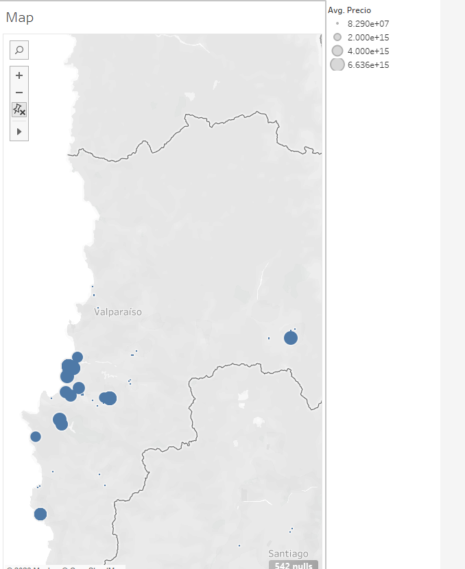

# Título del proyecto

Este es un proyecto que recopila datos de precios de propiedades en la Región de Valparaíso, Chile. Los datos son extraídos del sitio web MercadoLibre mediante web scraping y almacenados en un archivo CSV.

## Requisitos previos

- Python 3.x
- Librerías necesarias: requests, BeautifulSoup, pandas, matplotlib

## Cómo ejecutar el script

1. Clona este repositorio en tu máquina local.
2. Instala las librerías necesarias usando pip: `pip install -r requirements.txt`
3. Ejecuta el script `web_scraping.py` desde la línea de comandos: `python web_scraping.py`
4. Los datos extraídos se guardarán en el archivo `property_data.csv`.

## Visualización de los datos

Aquí está una captura de pantalla de la visualización de los datos extraídos:

## Contribuciones

¡Las contribuciones son bienvenidas! Si deseas contribuir a este proyecto, sigue estos pasos:

1. Haz un fork del repositorio.
2. Crea una rama para tu nueva función: `git checkout -b feature-nueva-funcion`
3. Haz los cambios necesarios y realiza los commits: `git commit -am 'Agregar nueva función'`
4. Empuja tus cambios a tu fork: `git push origin feature-nueva-funcion`
5. Abre un pull request.

## Licencia

Este proyecto está bajo la Licencia MIT. Ver el archivo `LICENSE` para más detalles.
